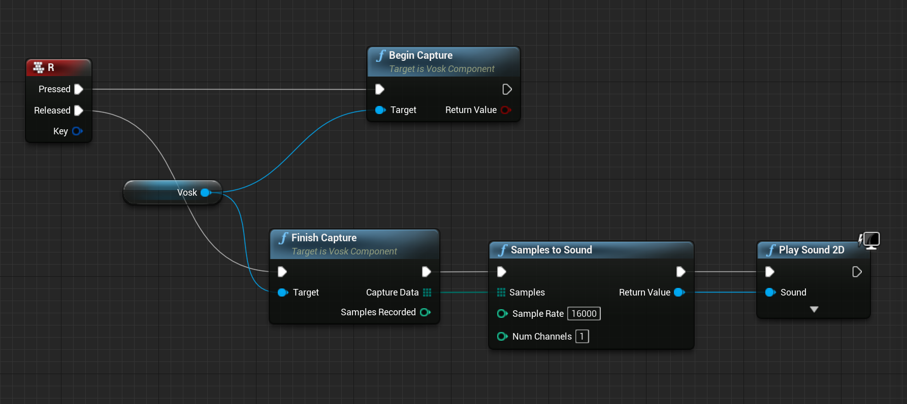
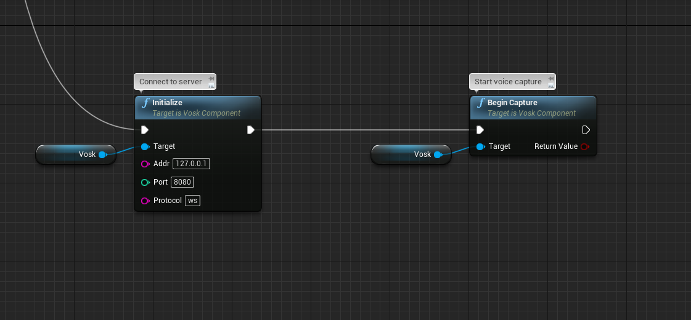
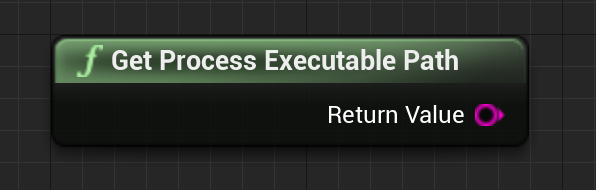

# **Offline Speech Recognition**


This is UE4 plugin for accurate speech recognition, and it doesn't not require internet connection.

# Important steps

To make microphone work, you need to add following lines to `DefaultEngine.ini` of the project.
```
[Voice]
bEnabled=true
```

To not loose pauses in between words, you probably want to check silence detection threshold `voice.SilenceDetectionThreshold`, value `0.01` is good.
This also goes to `DefaultEngine.ini`.

```
[SystemSettings]
voice.SilenceDetectionThreshold=0.01
```
Starting from Engine version 4.25 also put
```
voice.MicNoiseGateThreshold=0.01
```

Another voice related variables worth playing with
```bash
voice.MicNoiseGateThreshold
voice.MicInputGain
voice.MicStereoBias
voice.MicNoiseAttackTime
voice.MicNoiseReleaseTime
voice.MicStereoBias
voice.SilenceDetectionAttackTime
voice.SilenceDetectionReleaseTime
```

To find available settings type `voice.` in editor console, and autocompletion widget will pop up.


Console variables can be modified in runtime like this


To debug your microphone, input you can convert output sound buffer to
unreal sound wave and play it.



Above values may differ depending on actual microphone characteristics.


# Running language server
1. Download latest version [here](https://github.com/IlgarLunin/vosk-language-server/releases)
2. Run **vls.exe**, which is a user interface for **asr_server.exe**
   > **NOTE**: *asr_server.exe* is real server, you can run it without gui
   
3. Go to main menu -> File -> Download models
   
   

4. You will be redirected to a web page where you will find all available models (**languages**)
   
   

5. In order to start using language, first download one of them
6. Enter path to downloaded model to server UI and press **start** button
   
   

   > **!NOTE!**: Depending on model size, you need to wait until model loaded in to memory, before start feeding server with voice data. e.g. If model size is ~2GB, it acn take ~10-30 seconds. But this is one time event, you can load your language to memory once with OS startup.
   

7. Open unreal
8. Create actor blueprint
9. Add Vosk component in components panel

    

10. On begin play
    1. Bind to "Partial Result Received" event
    

    1. **[Optional]** Bind to "Final Result Received" event
    

    1. **[!MANDATORY!]** Connect to language server process and begin voice capture
    
    NOTE: `Addr` and `Port` coresponds to language server UI (*0.0.0.0 is the same as 127.0.0.1, it's just localhost*)
    


11. Start talking
12. Check *Partial Result Received* event gets executed

# Running server process and game process at the same time

Plugin offers following nodes


**Build Server Parameters** - helper method to simplify passing arguments to create process node

**Create Process** - Runs external program, this one is generic, you can use it to run whatever external program

 *NOTE*: *When you ship your game, you need to include language server as well, put language server files in your game bin folder (`GAME/Binaries/Win64/**`), and use "GetProcessExecutablePath" node to build path to `asr_server.exe`*



**Kill Process** - This is an equivalent of `Alt+F4`, it will shut down external process based on Process ID, the process id is process handle. Save output of `Create Process` node to a variable and use it later to terminate process.

Default use case:

* Create an `Actor` responsible for voice recognition
* Start language server on `Begin Play` event
* Add `Vosk` actor component and initialize it in begin play
* Begin capturing voice data
* Bind to message receive events
* Uninitialize vosk component and terminate server process on end play

> **NOTE**: *`Uninitialize` will stop voice capture if it is active*


# Passing SoundWave as input, instead of microphone

To do so, plugin offers a node that will convert sound into array of bytes, it is called `"Decompress Sound"`. You can than use output of decompress sound node in `"Send Voice Data to Language Server"` node, and expect partial and final result events being invoked later, when server finishes recognition.


> **NOTE**: *Do not call `BeginCapture` and `FinishCapture` in this case, since we don't want to use audio from the microphone*


## How **Send Data to Language Server** node works
It takes sound bytes as first argument, and packet size as second argument. It will split all bytes into packets of given size, and send them one after another to language server, emulating microphone capture behavior. If packet size is greater than size of voice data, data will not be sent. 4096 packet size works relatively fast and suitable for short phrases. Note that if packet size is small, it will take more time to deliver entire voice to the server, and server will perform more iterations accordingly. You should play around with packet size in your specific case.


# Platforms supported

Tested on **Windows**


# Links

Find out more in documentation

* [Vosk](https://alphacephei.com/vosk/)
