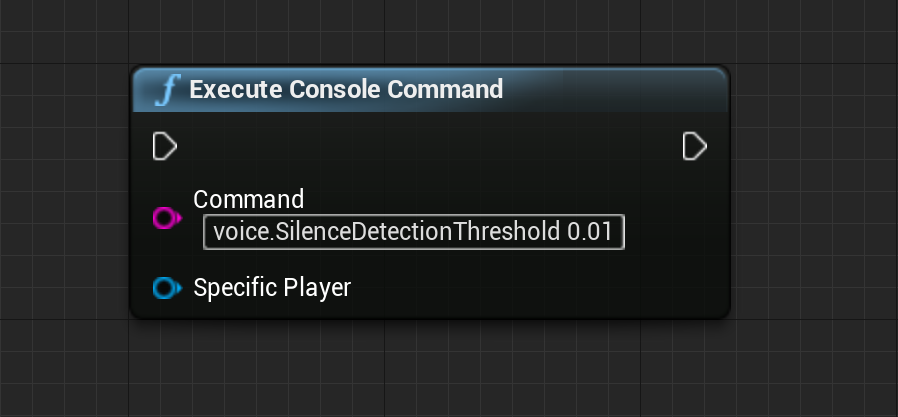

# **Offline Speech Recognition**


This is UE4 plugin for accurate speech recognition, and it doesn't not require internet connection.

# Important steps

To make microphone work, you need to add following lines to `DefaultEngine.ini` of the project.
```
[Voice]
bEnabled=true
```

To not loose pauses in between words, you probably want to check silence detection treshold `voice.SilenceDetectionThreshold`, value `0.01` is good.
This also goes to `DefaultEngine.ini`.

```
[SystemSettings]
voice.SilenceDetectionThreshold=0.01
```
Starting from Engine version 4.25 also put
```
voice.MicNoiseGateThreshold=0.01
```

Another voice related variables worth playing with
```bash
voice.MicNoiseGateThreshold
voice.MicInputGain
voice.MicStereoBias
voice.MicNoiseAttackTime
voice.MicNoiseReleaseTime
voice.MicStereoBias
voice.SilenceDetectionAttackTime
voice.SilenceDetectionReleaseTime
```

To find available settings type `voice.` in editor console, and autocompletion widget will pop up.


Console variables can be modified in runtime like this



To debug your microphone, input you can convert output sound buffer to
unreal sound wave and play it.


Above values may differ depending on actual microphone characteristics.


# Running language server
1. Download latest version [here](https://github.com/IlgarLunin/vosk-language-server/releases)
2. Run **vls.exe**, which is a user interface for **asr_server.exe**
   > **NOTE**: *asr_server.exe* is real server, you can run it without gui
   
3. Go to main menu -> File -> Download models
   
   

4. You will be redirected to a web page where you will find all available models (**languages**)
   
   

5. In order to start using language, first download one of them
6. Enter path to downloaded model to server UI and press **start** button
   
   

   > **!NOTE!**: Depending on model size, you need to wait until model loaded in to memory, before start feeding server with voice data. e.g. If model size is ~2GB, it acn take ~10-30 seconds.
   

7. Open unreal
8. Create actor blueprint
9. Add Vosk component in components panel

    

10. On begin play
    1. Bind to "Partial Result Received" event
    

    2. **[Optional]** Bind to "Final Result Received" event
    

    3. **[!MANDATORY!]** Connect to language server process and begin voice capture
    


3.  Start talking
4.  Check *Partial Result Received* event gets executed


## Minimal setup


# Platforms supported

Tested on **Windows**


# Links

Find out more in documentation

* [Vosk](https://alphacephei.com/vosk/)
